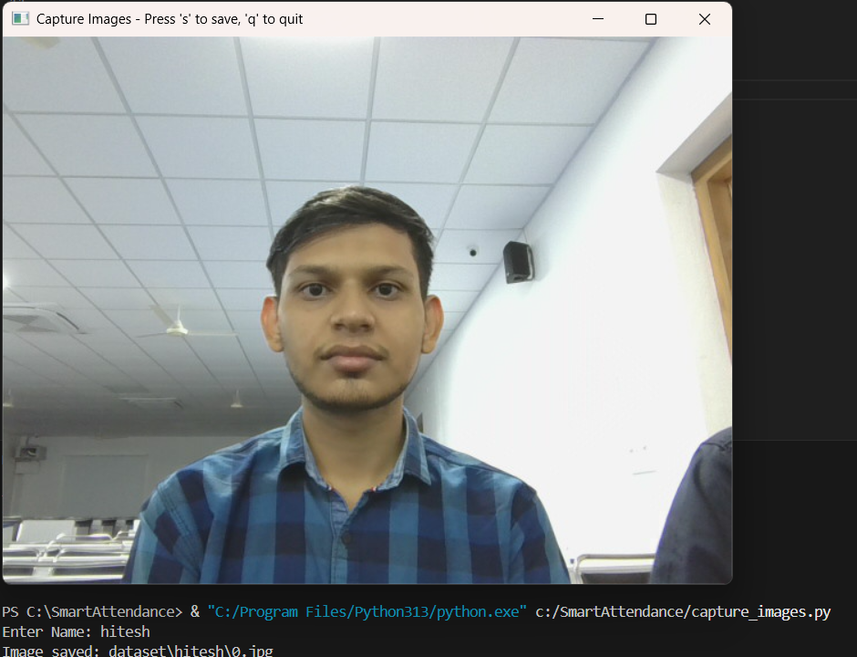
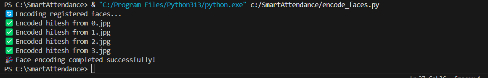
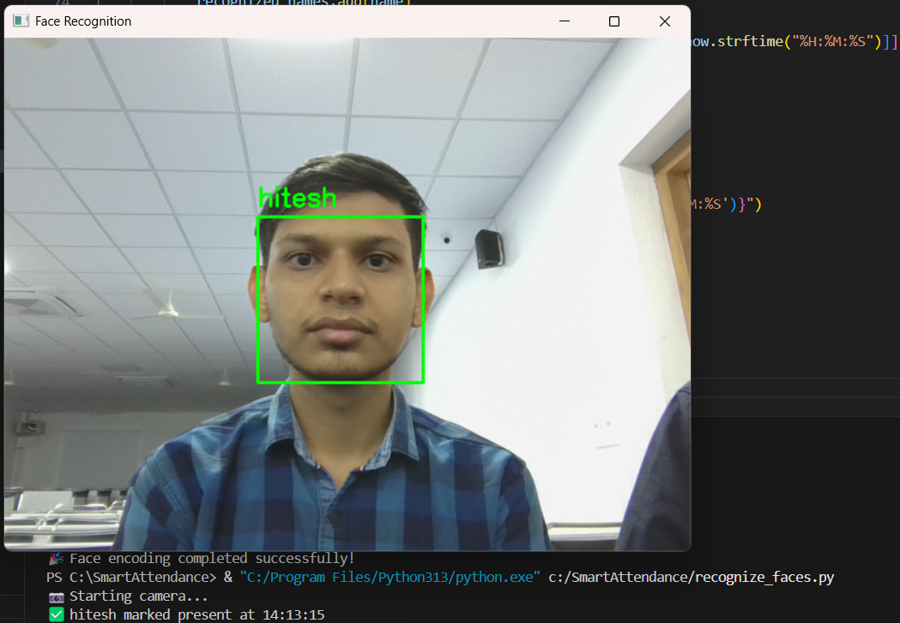
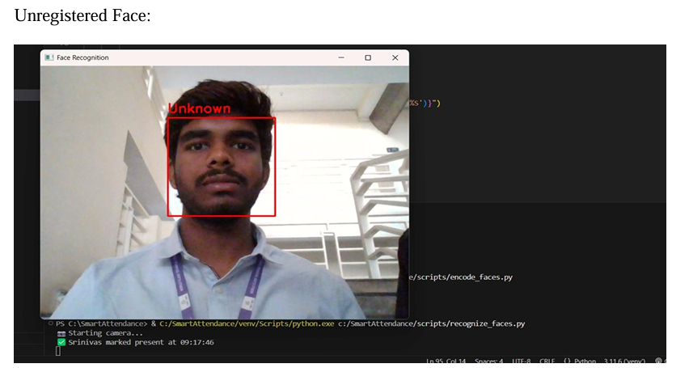

# Smart Attendance Using Facial Recognition 🎯

This project is a Python-based **Smart Attendance System** that uses **Facial Recognition** to automate and manage attendance securely and efficiently.
###📸 Execution Screenshots  
### 🎥 Face Capturing  


### 🧠 Face Encoding


### 🔍 Face Recognition & Attendance




## 📌 Features

- 🎥 Capture face images using a webcam
- 🧠 Encode and store facial features
- 🔍 Recognize faces in real-time
- 🗂 Record attendance automatically in a CSV file
- 🧾 Easy to use, lightweight, and no need for manual attendance

---

## 🚀 How It Works

1. **Image Capture (`capture_images.py`)**  
   Register a new person by capturing multiple face images via webcam.

2. **Face Encoding (`encode_faces.py`)**  
   Converts all captured images into numerical facial encodings and stores them using `dlib`.

3. **Face Recognition & Attendance (`recognize_faces.py`)**  
   Compares live webcam feed with known faces and marks attendance in `attendance.csv`.

---

## 🧰 Technologies Used

- Python 3.x
- OpenCV
- face-recognition
- dlib
- numpy
- pandas

---
## 📂 Project Structure
## 📂 Project Structure

```
Smart-Attendance-Using-Facial-Recognition/  

├── assets/                              # Images, icons, and other resources  
│   └── screenshots/                     # Project screenshots for README/presentation  

├── attendance/                          # Attendance logs  
│   └── attendance.csv                   # Stores daily attendance records  

├── dataset/                             # Registered users' face images  
│   └── [user_name]/                     # One folder per registered user  
│       ├── img1.jpg  
│       ├── img2.jpg  
│       └── ...  

├── encodings/                           # Stored face encoding files  
│   └── face_encodings.pkl                # Serialized encodings  

├── trainer/                             # Trained models  
│   └── trained_model.yml                 # Model trained on face data  

├── reports/                             # Generated attendance reports  
│   ├── daily_report.csv  
│   └── monthly_report.csv  

├── utils/                               # Helper scripts and utilities  
│   ├── helpers.py                       # Common helper functions  
│   └── config.py                        # Configurations (paths, constants)  

├── capture.py                           # Captures images for dataset  
├── encode.py                            # Encodes faces from dataset  
├── recognize.py                         # Recognizes faces & marks attendance  
├── main.py                              # Unified script to run full system  
├── requirements.txt                     # Python dependencies  
├── README.md                            # Documentation  
└── LICENSE                              # Optional license file  
```


##🧑‍💻 Author  
-Hitesh Choudhary  
gmail:sirvihitesh8@gmail.com
